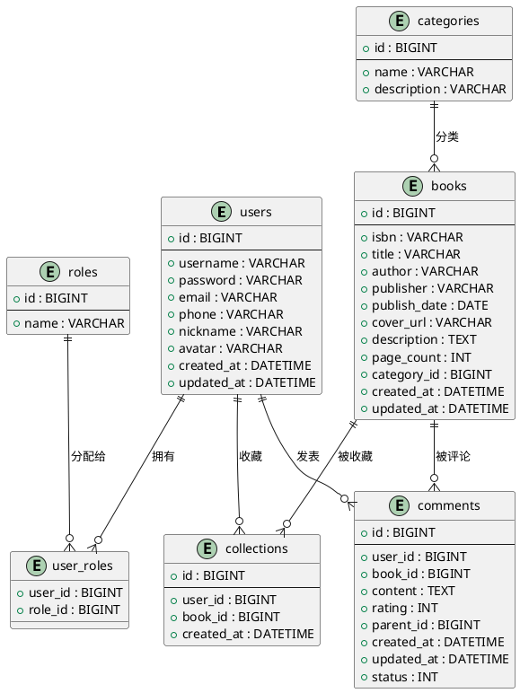

# 书籍管理与评论系统数据库设计文档

## 1. 引言

### 1.1 文档目的
本文档详细描述了书籍管理与评论系统的数据库设计方案，包括数据库系统选型、数据表结构、关系模型、索引设计、视图设计、存储过程设计以及安全策略等内容，为系统的数据库实现提供依据和指导。

### 1.2 文档范围
本文档涵盖了书籍管理与评论系统的全部数据库设计内容，适用于系统开发人员、数据库管理员以及相关技术人员。

### 1.3 参考资料
- 《书籍管理与评论系统需求规格说明书》
- 《书籍管理与评论系统概要设计文档》

## 2. 数据库系统概述

### 2.1 数据库选型
系统采用MySQL关系型数据库，版本要求5.7及以上。选择MySQL的主要原因包括：
- 开源免费，成本低
- 性能稳定，适用于中小型应用
- 兼容性好，与Java技术栈集成便捷
- 社区活跃，技术支持完善

### 2.2 数据库命名规范
- 数据库名：book_review_system
- 表名：采用小写英文单词或词组，单词之间用下划线分隔，如users、books等
- 字段名：采用小写英文单词或词组，单词之间用下划线分隔，如user_id、book_title等
- 索引名：idx_表名_字段名，如idx_users_username
- 视图名：v_表名_视图功能，如v_user_roles
- 存储过程名：sp_功能描述，如sp_get_book_comments

### 2.3 数据库字符集设置
- 数据库字符集：utf8mb4
- 排序规则：utf8mb4_unicode_ci
- 确保支持中文、emoji等特殊字符的存储

## 3. 数据库逻辑结构设计

### 3.1 数据库实体关系图



（注：使用PlantUML语法描述数据库关系，在支持PlantUML的Markdown渲染器中可直接显示图形）

## 4. 数据表详细设计

### 4.1 users表（用户表）
存储系统用户的基本信息。

| 字段名 | 数据类型 | 长度 | 约束 | 描述 |
|-------|---------|------|------|------|
| id | BIGINT | 20 | 主键，自增 | 用户ID |
| username | VARCHAR | 50 | 唯一，非空 | 用户名 |
| password | VARCHAR | 255 | 非空 | 密码（加密存储） |
| email | VARCHAR | 100 | 唯一 | 邮箱 |
| phone | VARCHAR | 20 | 唯一 | 手机号 |
| nickname | VARCHAR | 50 | | 昵称 |
| avatar | VARCHAR | 255 | | 头像URL |
| created_at | DATETIME | | 非空 | 创建时间 |
| updated_at | DATETIME | | 非空 | 更新时间 |

**创建语句：**
```sql
CREATE TABLE `users` (
  `id` BIGINT(20) NOT NULL AUTO_INCREMENT,
  `username` VARCHAR(50) NOT NULL,
  `password` VARCHAR(255) NOT NULL,
  `email` VARCHAR(100) DEFAULT NULL,
  `phone` VARCHAR(20) DEFAULT NULL,
  `nickname` VARCHAR(50) DEFAULT NULL,
  `avatar` VARCHAR(255) DEFAULT NULL,
  `created_at` DATETIME NOT NULL,
  `updated_at` DATETIME NOT NULL,
  PRIMARY KEY (`id`),
  UNIQUE KEY `uk_username` (`username`),
  UNIQUE KEY `uk_email` (`email`),
  UNIQUE KEY `uk_phone` (`phone`)
) ENGINE=InnoDB DEFAULT CHARSET=utf8mb4;
```

### 4.2 books表（书籍表）
存储书籍的详细信息。

| 字段名 | 数据类型 | 长度 | 约束 | 描述 |
|-------|---------|------|------|------|
| id | BIGINT | 20 | 主键，自增 | 书籍ID |
| isbn | VARCHAR | 20 | 唯一 | ISBN号 |
| title | VARCHAR | 255 | 非空 | 书名 |
| author | VARCHAR | 100 | 非空 | 作者 |
| publisher | VARCHAR | 100 | | 出版社 |
| publish_date | DATE | | | 出版日期 |
| cover_url | VARCHAR | 255 | | 封面URL |
| description | TEXT | | | 描述 |
| page_count | INT | 11 | | 页数 |
| category_id | BIGINT | 20 | 外键 | 分类ID |
| created_at | DATETIME | | 非空 | 创建时间 |
| updated_at | DATETIME | | 非空 | 更新时间 |

**创建语句：**
```sql
CREATE TABLE `books` (
  `id` BIGINT(20) NOT NULL AUTO_INCREMENT,
  `isbn` VARCHAR(20) DEFAULT NULL,
  `title` VARCHAR(255) NOT NULL,
  `author` VARCHAR(100) NOT NULL,
  `publisher` VARCHAR(100) DEFAULT NULL,
  `publish_date` DATE DEFAULT NULL,
  `cover_url` VARCHAR(255) DEFAULT NULL,
  `description` TEXT,
  `page_count` INT(11) DEFAULT NULL,
  `category_id` BIGINT(20) DEFAULT NULL,
  `created_at` DATETIME NOT NULL,
  `updated_at` DATETIME NOT NULL,
  PRIMARY KEY (`id`),
  UNIQUE KEY `uk_isbn` (`isbn`),
  KEY `fk_books_category_id` (`category_id`),
  CONSTRAINT `fk_books_category_id` FOREIGN KEY (`category_id`) REFERENCES `categories` (`id`)
) ENGINE=InnoDB DEFAULT CHARSET=utf8mb4;
```


### 4.3 categories表（分类表）
存储书籍分类信息。

| 字段名 | 数据类型 | 长度 | 约束 | 描述 |
|-------|---------|------|------|------|
| id | BIGINT | 20 | 主键，自增 | 分类ID |
| name | VARCHAR | 50 | 唯一，非空 | 分类名称 |
| description | VARCHAR | 255 | | 分类描述 |

**创建语句：**
```sql
CREATE TABLE `categories` (
  `id` BIGINT(20) NOT NULL AUTO_INCREMENT,
  `name` VARCHAR(50) NOT NULL,
  `description` VARCHAR(255) DEFAULT NULL,
  PRIMARY KEY (`id`),
  UNIQUE KEY `uk_name` (`name`)
) ENGINE=InnoDB DEFAULT CHARSET=utf8mb4;
```


### 4.4 comments表（评论表）
存储用户对书籍的评论信息。

| 字段名 | 数据类型 | 长度 | 约束 | 描述 |
|-------|---------|------|------|------|
| id | BIGINT | 20 | 主键，自增 | 评论ID |
| user_id | BIGINT | 20 | 外键，非空 | 用户ID |
| book_id | BIGINT | 20 | 外键，非空 | 书籍ID |
| content | TEXT | | 非空 | 评论内容 |
| rating | INT | 11 | | 评分（1-5星） |
| parent_id | BIGINT | 20 | 外键 | 父评论ID（用于回复） |
| created_at | DATETIME | | 非空 | 创建时间 |
| updated_at | DATETIME | | 非空 | 更新时间 |
| status | INT | 11 | 非空 | 状态（0：待审核，1：正常，2：已删除） |

**创建语句：**
```sql
CREATE TABLE `comments` (
  `id` BIGINT(20) NOT NULL AUTO_INCREMENT,
  `user_id` BIGINT(20) NOT NULL,
  `book_id` BIGINT(20) NOT NULL,
  `content` TEXT NOT NULL,
  `rating` INT(11) DEFAULT NULL,
  `parent_id` BIGINT(20) DEFAULT NULL,
  `created_at` DATETIME NOT NULL,
  `updated_at` DATETIME NOT NULL,
  `status` INT(11) NOT NULL,
  PRIMARY KEY (`id`),
  KEY `fk_comments_user_id` (`user_id`),
  KEY `fk_comments_book_id` (`book_id`),
  KEY `fk_comments_parent_id` (`parent_id`),
  CONSTRAINT `fk_comments_user_id` FOREIGN KEY (`user_id`) REFERENCES `users` (`id`),
  CONSTRAINT `fk_comments_book_id` FOREIGN KEY (`book_id`) REFERENCES `books` (`id`),
  CONSTRAINT `fk_comments_parent_id` FOREIGN KEY (`parent_id`) REFERENCES `comments` (`id`)
) ENGINE=InnoDB DEFAULT CHARSET=utf8mb4;
```


### 4.5 collections表（收藏表）
存储用户收藏的书籍信息。

| 字段名 | 数据类型 | 长度 | 约束 | 描述 |
|-------|---------|------|------|------|
| id | BIGINT | 20 | 主键，自增 | 收藏ID |
| user_id | BIGINT | 20 | 外键，非空 | 用户ID |
| book_id | BIGINT | 20 | 外键，非空 | 书籍ID |
| created_at | DATETIME | | 非空 | 收藏时间 |

**创建语句：**
```sql
CREATE TABLE `collections` (
  `id` BIGINT(20) NOT NULL AUTO_INCREMENT,
  `user_id` BIGINT(20) NOT NULL,
  `book_id` BIGINT(20) NOT NULL,
  `created_at` DATETIME NOT NULL,
  PRIMARY KEY (`id`),
  UNIQUE KEY `uk_user_book` (`user_id`,`book_id`),
  KEY `fk_collections_book_id` (`book_id`),
  CONSTRAINT `fk_collections_user_id` FOREIGN KEY (`user_id`) REFERENCES `users` (`id`),
  CONSTRAINT `fk_collections_book_id` FOREIGN KEY (`book_id`) REFERENCES `books` (`id`)
) ENGINE=InnoDB DEFAULT CHARSET=utf8mb4;
```


### 4.6 roles表（角色表）
存储系统角色信息。

| 字段名 | 数据类型 | 长度 | 约束 | 描述 |
|-------|---------|------|------|------|
| id | BIGINT | 20 | 主键，自增 | 角色ID |
| name | VARCHAR | 50 | 唯一，非空 | 角色名称 |

**创建语句：**
```sql
CREATE TABLE `roles` (
  `id` BIGINT(20) NOT NULL AUTO_INCREMENT,
  `name` VARCHAR(50) NOT NULL,
  PRIMARY KEY (`id`),
  UNIQUE KEY `uk_name` (`name`)
) ENGINE=InnoDB DEFAULT CHARSET=utf8mb4;
```


### 4.7 user_roles表（用户角色关联表）
存储用户与角色的关联关系，实现多对多的用户-角色映射。

| 字段名 | 数据类型 | 长度 | 约束 | 描述 |
|-------|---------|------|------|------|
| user_id | BIGINT | 20 | 外键，非空 | 用户ID |
| role_id | BIGINT | 20 | 外键，非空 | 角色ID |

**创建语句：**
```sql
CREATE TABLE `user_roles` (
  `user_id` BIGINT(20) NOT NULL,
  `role_id` BIGINT(20) NOT NULL,
  PRIMARY KEY (`user_id`,`role_id`),
  KEY `fk_user_roles_role_id` (`role_id`),
  CONSTRAINT `fk_user_roles_user_id` FOREIGN KEY (`user_id`) REFERENCES `users` (`id`),
  CONSTRAINT `fk_user_roles_role_id` FOREIGN KEY (`role_id`) REFERENCES `roles` (`id`)
) ENGINE=InnoDB DEFAULT CHARSET=utf8mb4;
```


## 5. 索引设计

### 5.1 主键索引
所有表均已设置主键（PRIMARY KEY），系统自动创建主键索引。

### 5.2 唯一索引
- users表：username、email、phone字段设置唯一索引，确保唯一性
- books表：isbn字段设置唯一索引，确保书籍唯一性
- categories表：name字段设置唯一索引，确保分类名称唯一性
- roles表：name字段设置唯一索引，确保角色名称唯一性
- collections表：user_id和book_id组合设置唯一索引，确保一个用户只能收藏一本书一次
- user_roles表：user_id和role_id组合设置唯一索引，确保一个用户只能有一个特定角色

### 5.3 普通索引
- books表：category_id字段设置普通索引，优化按分类查询效率
- comments表：user_id、book_id、parent_id字段设置普通索引，优化按用户、书籍和评论回复查询效率
- collections表：book_id字段设置普通索引，优化按书籍查询收藏记录效率
- user_roles表：role_id字段设置普通索引，优化按角色查询用户效率

### 5.4 复合索引建议
根据系统查询需求，以下是复合索引建议：
- books表：可考虑添加(title, author)复合索引，优化按书名和作者的联合查询
- comments表：可考虑添加(book_id, created_at)复合索引，优化按书籍和时间排序的评论查询
- users表：可考虑添加(email, password)复合索引，优化登录验证查询

## 6. 视图设计

根据系统需求，设计以下视图：

### 6.1 v_user_roles视图
展示用户及其角色信息的视图，方便查询用户权限。

```sql
CREATE VIEW v_user_roles AS
SELECT 
  u.id AS user_id,
  u.username,
  u.nickname,
  u.email,
  r.id AS role_id,
  r.name AS role_name
FROM users u
LEFT JOIN user_roles ur ON u.id = ur.user_id
LEFT JOIN roles r ON ur.role_id = r.id;
```

### 6.2 v_book_comments视图
展示书籍及其评论信息的视图，方便获取书籍评论概览。

```sql
CREATE VIEW v_book_comments AS
SELECT 
  b.id AS book_id,
  b.title,
  b.author,
  c.id AS comment_id,
  c.user_id,
  u.username AS comment_user,
  c.content,
  c.rating,
  c.created_at AS comment_time
FROM books b
LEFT JOIN comments c ON b.id = c.book_id
LEFT JOIN users u ON c.user_id = u.id
WHERE c.status = 1;
```

### 6.3 v_book_statistics视图
展示书籍统计信息的视图，包括评论数量、平均评分、收藏数量等。

```sql
CREATE VIEW v_book_statistics AS
SELECT 
  b.id,
  b.title,
  COUNT(DISTINCT c.id) AS comment_count,
  AVG(c.rating) AS avg_rating,
  COUNT(DISTINCT col.id) AS collection_count
FROM books b
LEFT JOIN comments c ON b.id = c.book_id AND c.status = 1
LEFT JOIN collections col ON b.id = col.book_id
GROUP BY b.id, b.title;
```

## 7. 存储过程设计

根据系统需求，设计以下存储过程：

### 7.1 sp_get_book_detail存储过程
获取书籍详细信息及其相关数据的存储过程。

```sql
DELIMITER $$
CREATE PROCEDURE sp_get_book_detail(IN bookId BIGINT)
BEGIN
  SELECT 
    b.*,
    c.name AS category_name,
    COUNT(DISTINCT cm.id) AS comment_count,
    AVG(cm.rating) AS avg_rating
  FROM books b
  LEFT JOIN categories c ON b.category_id = c.id
  LEFT JOIN comments cm ON b.id = cm.book_id AND cm.status = 1
  WHERE b.id = bookId
  GROUP BY b.id;
END $$
DELIMITER ;
```

### 7.2 sp_search_books存储过程
根据关键词搜索书籍的存储过程，支持多字段搜索。

```sql
DELIMITER $$
CREATE PROCEDURE sp_search_books(IN keyword VARCHAR(255), IN categoryId BIGINT)
BEGIN
  SELECT 
    b.*,
    c.name AS category_name
  FROM books b
  LEFT JOIN categories c ON b.category_id = c.id
  WHERE 
    (b.title LIKE CONCAT('%', keyword, '%') 
    OR b.author LIKE CONCAT('%', keyword, '%')
    OR b.description LIKE CONCAT('%', keyword, '%'))
    AND (categoryId IS NULL OR b.category_id = categoryId)
  ORDER BY b.created_at DESC;
END $$
DELIMITER ;
```

### 7.3 sp_add_book_comment存储过程
添加书籍评论的存储过程，包含基本的参数验证。

```sql
DELIMITER $$
CREATE PROCEDURE sp_add_book_comment(
  IN userId BIGINT,
  IN bookId BIGINT,
  IN commentContent TEXT,
  IN ratingValue INT,
  IN parentCommentId BIGINT
)
BEGIN
  -- 参数验证
  IF commentContent IS NULL OR LENGTH(TRIM(commentContent)) = 0 THEN
    SIGNAL SQLSTATE '45000' SET MESSAGE_TEXT = '评论内容不能为空';
  END IF;
  
  IF ratingValue < 1 OR ratingValue > 5 THEN
    SIGNAL SQLSTATE '45000' SET MESSAGE_TEXT = '评分必须在1-5之间';
  END IF;
  
  -- 插入评论
  INSERT INTO comments (user_id, book_id, content, rating, parent_id, created_at, updated_at, status)
  VALUES (userId, bookId, commentContent, ratingValue, parentCommentId, NOW(), NOW(), 1);
  
  -- 返回新插入的评论ID
  SELECT LAST_INSERT_ID() AS comment_id;
END $$
DELIMITER ;
```

## 8. 数据库安全设计

### 8.1 用户与权限管理
- 创建专用数据库用户，避免使用root用户进行应用连接
- 为不同用户分配最小必要权限，遵循权限分离原则
- 定期更新数据库用户密码，使用强密码策略

### 8.2 数据加密
- 敏感数据（如用户密码）使用BCrypt等加密算法进行加密存储
- 传输层采用SSL/TLS加密，确保数据传输安全

### 8.3 SQL注入防护
- 使用参数化查询，避免直接拼接SQL语句
- 对用户输入进行严格的验证和过滤
- 采用ORM框架进行数据库操作，减少SQL注入风险

### 8.4 日志审计
- 启用数据库日志功能，记录关键操作和错误信息
- 定期审计数据库日志，及时发现异常行为

## 9. 数据库备份与恢复策略

### 9.1 备份策略
- 全量备份：每周执行一次数据库全量备份
- 增量备份：每天执行一次数据库增量备份
- 日志备份：实时备份二进制日志文件

### 9.2 恢复策略
- 制定详细的数据恢复流程和步骤
- 定期进行数据恢复测试，确保备份数据的可用性
- 建立灾难恢复机制，确保在发生重大故障时能够快速恢复数据

### 9.3 备份存储
- 备份数据存储在独立的存储设备上
- 关键备份数据进行异地存储，防止单点故障
- 备份数据设置访问控制，确保数据安全

## 10. 数据库性能优化建议

### 10.1 查询优化
- 合理设计索引，避免过多或不必要的索引
- 优化SQL查询语句，避免全表扫描
- 使用连接查询替代子查询，提高查询效率

### 10.2 表结构优化
- 根据数据访问模式，合理设计表结构
- 适当进行表的垂直拆分和水平拆分
- 避免大字段存储，可考虑将大字段分离存储

### 10.3 缓存机制
- 引入Redis等缓存机制，缓存热点数据
- 合理设置缓存过期时间，保证数据一致性
- 使用多级缓存架构，提高系统响应速度

### 10.4 服务器配置优化
- 根据系统负载，合理配置数据库服务器参数
- 优化存储引擎配置，选择适合业务场景的存储引擎
- 定期进行数据库碎片整理，提高存储效率

## 11. 附录

### 11.1 数据字典
| 表名 | 描述 |
|-----|------|
| users | 用户基本信息表 |
| books | 书籍详细信息表 |
| categories | 书籍分类表 |
| comments | 书籍评论表 |
| collections | 书籍收藏表 |
| roles | 系统角色表 |
| user_roles | 用户角色关联表 |

### 11.2 版本历史
| 版本 | 修改日期 | 修改内容 | 修改人 |
|-----|---------|---------|-------|
| 1.0 | 2023-xx-xx | 初始版本 | xxx |
| 1.1 | 2023-xx-xx | 更新索引设计 | xxx |
| 1.2 | 2023-xx-xx | 添加视图和存储过程 | xxx |