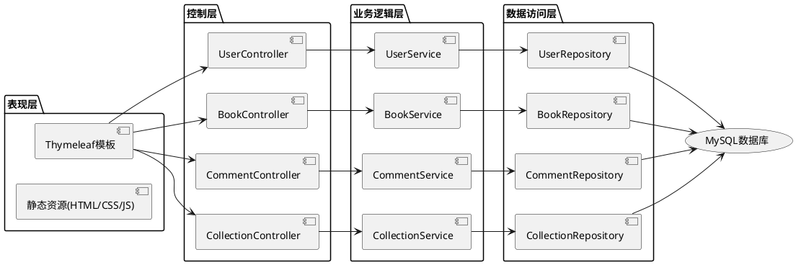
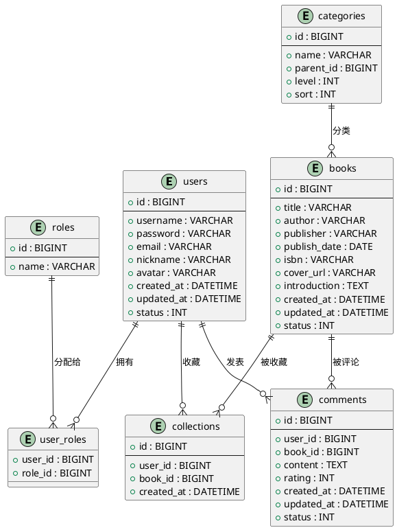

# 书籍管理与评论系统概要设计文档

## 1. 引言

### 1.1 文档目的
本文档旨在详细描述书籍管理与评论系统的概要设计，包括系统架构、模块设计、数据库设计等关键设计要素，为后续的详细设计和编码实现提供指导。

### 1.2 文档范围
本文档涵盖了书籍管理与评论系统的整体架构设计、核心功能模块设计、数据库设计、界面设计概要等内容。

### 1.3 参考资料
- 《书籍管理与评论系统需求规格说明书》

## 2. 系统架构设计

### 2.1 整体架构
系统采用前后端不分离的Spring Boot架构设计，主要包含以下几层：

- **表现层**：使用Thymeleaf模板引擎在服务器端渲染HTML页面，负责用户界面展示
- **控制层**：处理HTTP请求，调用业务层进行逻辑处理，并返回视图或数据
- **业务逻辑层**：处理核心业务逻辑，确保业务规则的正确执行
- **数据访问层**：负责数据持久化和检索，与数据库进行交互

### 2.2 技术架构

系统采用前后端不分离的Spring Boot架构，主要技术组件如下：

1. **后端框架**：Spring Boot 2.7.x
2. **ORM框架**：Spring Data JPA / MyBatis
3. **安全框架**：Spring Security
4. **前端技术**：HTML5, CSS3, JavaScript, Thymeleaf模板引擎
5. **数据库**：MySQL 8.0
6. **构建工具**：Maven
7. **版本控制**：Git

（注：使用PlantUML语法描述系统架构，在支持PlantUML的Markdown渲染器中可直接显示图形）

## 3. 模块设计

### 3.1 用户管理模块

#### 3.1.1 功能描述
负责用户的注册、登录、信息管理和权限控制等功能。

#### 3.1.2 核心类
- `User`：用户实体类
- `UserController`：处理用户相关请求的控制器
- `UserService`：用户业务逻辑接口
- `UserServiceImpl`：用户业务逻辑实现类
- `UserRepository`：用户数据访问接口
- `UserDetailsServiceImpl`：Spring Security用户认证实现

#### 3.1.3 主要流程
- 用户注册流程：接收用户注册信息 → 验证信息合法性 → 加密密码 → 保存用户信息
- 用户登录流程：接收登录凭证 → 验证凭证 → 生成会话 → 返回登录结果
- 用户信息修改流程：接收修改请求 → 验证权限 → 更新用户信息

### 3.2 书籍管理模块

#### 3.2.1 功能描述
负责书籍的添加、编辑、查询、浏览和收藏等功能。

#### 3.2.2 核心类
- `Book`：书籍实体类
- `Category`：书籍分类实体类
- `BookController`：处理书籍相关请求的控制器
- `BookService`：书籍业务逻辑接口
- `BookServiceImpl`：书籍业务逻辑实现类
- `BookRepository`：书籍数据访问接口
- `CategoryRepository`：分类数据访问接口
- `Collection`：收藏实体类
- `CollectionService`：收藏业务逻辑接口
- `CollectionRepository`：收藏数据访问接口

#### 3.2.3 主要流程
- 书籍添加流程：接收书籍信息 → 验证信息 → 保存书籍信息
- 书籍查询流程：接收查询条件 → 构建查询 → 执行查询 → 返回结果
- 书籍收藏流程：接收收藏请求 → 验证权限 → 创建收藏记录

### 3.3 评论管理模块

#### 3.3.1 功能描述
负责评论的发布、互动和管理等功能。

#### 3.3.2 核心类
- `Comment`：评论实体类
- `CommentController`：处理评论相关请求的控制器
- `CommentService`：评论业务逻辑接口
- `CommentServiceImpl`：评论业务逻辑实现类
- `CommentRepository`：评论数据访问接口

#### 3.3.3 主要流程
- 评论发布流程：接收评论内容 → 验证权限 → 保存评论信息
- 评论点赞流程：接收点赞请求 → 验证权限 → 更新点赞状态
- 评论回复流程：接收回复内容 → 验证权限 → 保存回复信息
- 评论审核流程：接收审核请求 → 验证管理员权限 → 更新评论状态

## 4. 数据库设计

### 4.1 数据库概览
系统采用MySQL关系型数据库，主要包含以下数据表：
- users：用户表
- books：书籍表
- categories：分类表
- comments：评论表
- collections：收藏表
- roles：角色表
- user_roles：用户角色关联表

### 4.2 数据表设计

#### 4.2.1 users表

| 字段名 | 数据类型 | 长度 | 约束 | 描述 |
|-------|---------|------|------|------|
| id | BIGINT | 20 | 主键，自增 | 用户ID |
| username | VARCHAR | 50 | 唯一，非空 | 用户名 |
| password | VARCHAR | 255 | 非空 | 密码（加密存储） |
| email | VARCHAR | 100 | 唯一 | 邮箱 |
| phone | VARCHAR | 20 | 唯一 | 手机号 |
| nickname | VARCHAR | 50 | | 昵称 |
| avatar | VARCHAR | 255 | | 头像URL |
| created_at | DATETIME | | 非空 | 创建时间 |
| updated_at | DATETIME | | 非空 | 更新时间 |

#### 4.2.2 books表

| 字段名 | 数据类型 | 长度 | 约束 | 描述 |
|-------|---------|------|------|------|
| id | BIGINT | 20 | 主键，自增 | 书籍ID |
| isbn | VARCHAR | 20 | 唯一 | ISBN号 |
| title | VARCHAR | 255 | 非空 | 书名 |
| author | VARCHAR | 100 | 非空 | 作者 |
| publisher | VARCHAR | 100 | | 出版社 |
| publish_date | DATE | | | 出版日期 |
| cover_url | VARCHAR | 255 | | 封面URL |
| description | TEXT | | | 描述 |
| page_count | INT | 11 | | 页数 |
| category_id | BIGINT | 20 | 外键 | 分类ID |
| created_at | DATETIME | | 非空 | 创建时间 |
| updated_at | DATETIME | | 非空 | 更新时间 |

#### 4.2.3 categories表

| 字段名 | 数据类型 | 长度 | 约束 | 描述 |
|-------|---------|------|------|------|
| id | BIGINT | 20 | 主键，自增 | 分类ID |
| name | VARCHAR | 50 | 唯一，非空 | 分类名称 |
| description | VARCHAR | 255 | | 分类描述 |

#### 4.2.4 comments表

| 字段名 | 数据类型 | 长度 | 约束 | 描述 |
|-------|---------|------|------|------|
| id | BIGINT | 20 | 主键，自增 | 评论ID |
| user_id | BIGINT | 20 | 外键，非空 | 用户ID |
| book_id | BIGINT | 20 | 外键，非空 | 书籍ID |
| content | TEXT | | 非空 | 评论内容 |
| rating | INT | 11 | | 评分（1-5星） |
| parent_id | BIGINT | 20 | 外键 | 父评论ID（用于回复） |
| created_at | DATETIME | | 非空 | 创建时间 |
| updated_at | DATETIME | | 非空 | 更新时间 |
| status | INT | 11 | 非空 | 状态（0：待审核，1：正常，2：已删除） |

#### 4.2.5 collections表

| 字段名 | 数据类型 | 长度 | 约束 | 描述 |
|-------|---------|------|------|------|
| id | BIGINT | 20 | 主键，自增 | 收藏ID |
| user_id | BIGINT | 20 | 外键，非空 | 用户ID |
| book_id | BIGINT | 20 | 外键，非空 | 书籍ID |
| created_at | DATETIME | | 非空 | 收藏时间 |

#### 4.2.6 roles表

| 字段名 | 数据类型 | 长度 | 约束 | 描述 |
|-------|---------|------|------|------|
| id | BIGINT | 20 | 主键，自增 | 角色ID |
| name | VARCHAR | 50 | 唯一，非空 | 角色名称 |

#### 4.2.7 user_roles表

| 字段名 | 数据类型 | 长度 | 约束 | 描述 |
|-------|---------|------|------|------|
| user_id | BIGINT | 20 | 外键，非空 | 用户ID |
| role_id | BIGINT | 20 | 外键，非空 | 角色ID |

### 4.3 数据库关系图

（注：使用PlantUML语法描述数据库关系，在支持PlantUML的Markdown渲染器中可直接显示图形）

## 5. 界面设计概要

### 5.1 整体布局
系统采用响应式设计，主要布局包括：
- 顶部导航栏：Logo、主要功能入口、用户信息
- 侧边栏：功能菜单（根据用户权限动态显示）
- 主内容区：根据用户操作显示不同内容
- 底部：版权信息、备案信息等

### 5.2 主要页面

#### 5.2.1 首页
- 热门书籍推荐
- 新书上架展示
- 搜索框
- 分类导航

#### 5.2.2 书籍列表页
- 多条件筛选功能
- 排序功能
- 分页显示
- 书籍卡片展示

#### 5.2.3 书籍详情页
- 书籍基本信息展示
- 书籍封面大图
- 书籍描述
- 评论区域
- 收藏按钮

#### 5.2.4 用户注册/登录页
- 表单验证
- 错误提示
- 记住密码选项
- 找回密码入口

#### 5.2.5 个人中心
- 个人资料展示与修改
- 我的收藏列表
- 我的评论列表

#### 5.2.6 管理员后台
- 用户管理模块
- 书籍管理模块
- 评论管理模块
- 分类管理模块

## 6. 接口设计

### 6.1 控制器设计

#### 6.1.1 UserController
- `/register`：用户注册
- `/login`：用户登录
- `/logout`：用户登出
- `/user/profile`：查看/修改个人资料
- `/user/password`：修改密码
- `/user/reset-password`：重置密码

#### 6.1.2 BookController
- `/books`：书籍列表
- `/books/detail/{id}`：书籍详情
- `/books/search`：搜索书籍
- `/books/collect/{id}`：收藏书籍
- `/books/collections`：我的收藏（需要管理员权限）
- `/admin/books/add`：添加书籍（需要管理员权限）
- `/admin/books/edit/{id}`：编辑书籍（需要管理员权限）
- `/admin/books/delete/{id}`：删除书籍（需要管理员权限）

#### 6.1.3 CommentController
- `/comments/add/{bookId}`：发表评论
- `/comments/like/{id}`：点赞评论
- `/comments/reply/{id}`：回复评论
- `/comments/delete/{id}`：删除评论
- `/admin/comments`：评论管理（需要管理员权限）
- `/admin/comments/audit/{id}`：审核评论（需要管理员权限）

#### 6.1.4 AdminController
- `/admin/dashboard`：管理后台首页
- `/admin/users`：用户管理
- `/admin/categories`：分类管理

### 6.2 请求与响应格式
由于采用前后端不分离架构，大部分请求直接返回HTML视图。对于异步请求，采用JSON格式进行数据交互。

## 7. 安全设计

### 7.1 认证与授权
- 使用Spring Security实现用户认证和授权
- 基于角色的访问控制（RBAC）
- 密码加密存储（BCrypt）

### 7.2 防止常见安全问题
- CSRF防护
- XSS防护
- SQL注入防护
- 文件上传安全控制

### 7.3 日志记录与审计
- 关键操作日志记录
- 用户行为审计

## 8. 部署设计

### 8.1 部署环境要求
- JDK 1.8+ 
- MySQL 5.7+ 
- Tomcat 9.0+（或使用Spring Boot内嵌Tomcat）
- 操作系统：Windows/Linux

### 8.2 部署架构
- 单服务器部署：适用于小型应用和测试环境
- 负载均衡部署：适用于生产环境，提高系统可用性和性能

### 8.3 配置管理
- 环境配置分离（开发环境、测试环境、生产环境）
- 敏感信息加密存储

## 9. 性能优化

### 9.1 数据库优化
- 合理设计索引
- 优化查询语句
- 连接池配置

### 9.2 缓存策略
- 使用Redis缓存热点数据
- 页面缓存

### 9.3 代码优化
- 延迟加载
- 批处理操作
- 异步处理

## 10. 后续工作计划

1. 详细设计阶段
2. 编码实现阶段
3. 测试阶段
4. 部署上线阶段
5. 运维与维护阶段

---

**文档版本**：1.0
**编写日期**：2023年XX月XX日
**审批人**：XXX